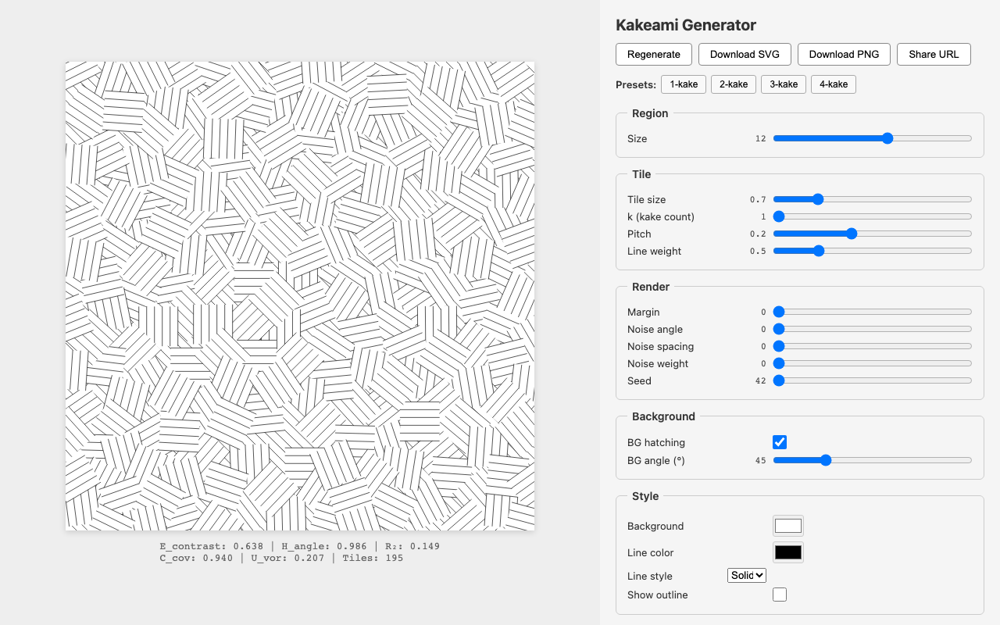
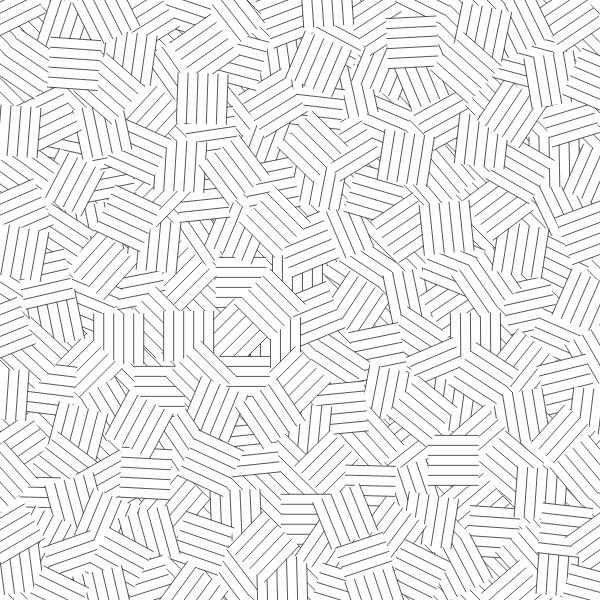
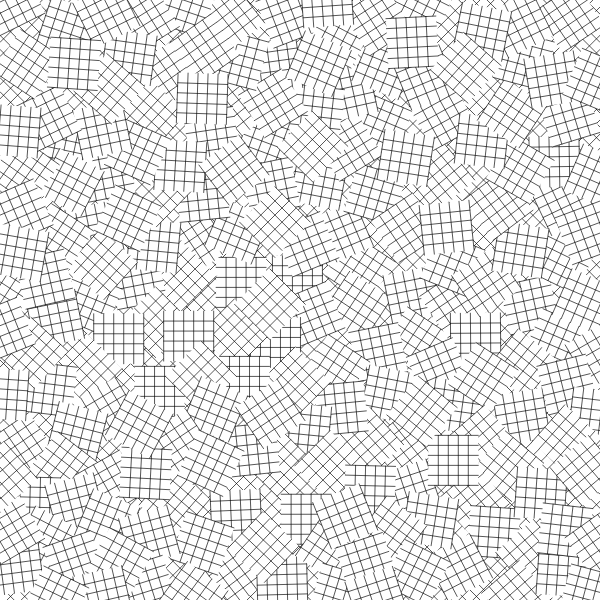
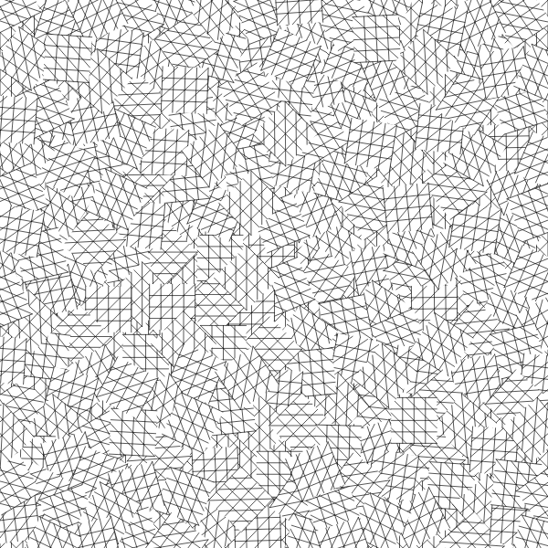
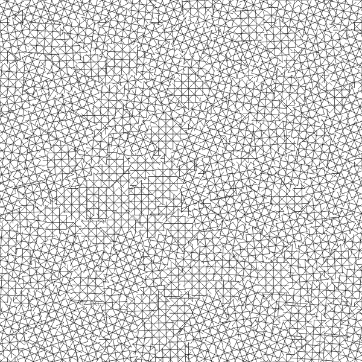

# Kakeami Generator

**カケアミ**（kakeami）は、漫画で使われる伝統的なハッチング技法です。本ツールは、カケアミのタイル配置を数理モデルで再現し、ブラウザ上でリアルタイムにパラメータを調整しながら生成・エクスポートできるWebアプリケーションです。

**[Generator を試す](https://kakeami.github.io/kakeami-generator/)** | **[Experiment Report を読む](https://kakeami.github.io/kakeami-generator/experiments/)**



## 生成例

k（重ね数）を変えることで、カケアミの密度と表情が変化します。

| k=1 | k=2 | k=3 | k=4 |
|:---:|:---:|:---:|:---:|
|  |  |  |  |

## Features

- **Voronoi coloring アルゴリズム** — Poisson-disk sampling + BFS greedy 角度割り当てにより、自然な見た目のカケアミを生成
- **リアルタイムプレビュー** — パラメータを変更すると即座に結果を確認
- **プリセット** — 1-kake / 2-kake / 3-kake / 4-kake の4種
- **エクスポート** — SVG または高解像度 PNG（4096x4096）でダウンロード
- **URL共有** — パラメータをURLに埋め込んで共有可能
- **サーバ不要** — すべてブラウザ内で完結

## Getting Started

```bash
npm install
npm run dev
```

表示されたURLをブラウザで開くと、カケアミの生成・プレビュー画面が立ち上がります。右側のパネルでパラメータを調整してください。

### Production Build

```bash
npm run build
```

`dist/` に出力されます。GitHub Pages、Netlify 等の静的ホスティングにそのままデプロイできます。

### Tests

```bash
npm test
```

## How It Works

カケアミは、平行なハッチング線で埋められた矩形タイルの集合体です。隣接するタイルのハッチング角度を最大限に異ならせることで、独特の視覚的テクスチャが生まれます。

本ツールのアルゴリズムは以下のステップで動作します。

1. **Poisson-disk sampling** — 領域内にタイル中心を均一に配置
2. **Voronoi 分割** — 各中心点からタイル領域を決定
3. **BFS greedy 角度割り当て** — 隣接タイル間の角度コントラストを最大化

角度の距離計算には実射影直線 RP<sup>1</sup> 上の Fubini-Study 距離を使用しています。

## Experiment Report

配置アルゴリズム（Poisson-disk vs. ランダム）と角度割り当て（BFS greedy vs. ランダム）の 2x2 要因計画で100シードを評価した実験レポートを公開しています。

**[Experiment Report](https://kakeami.github.io/kakeami-generator/experiments/)**

## Tech Stack

- **TypeScript** + **Vite**（UIフレームワーク不使用）
- **d3-delaunay** — Voronoi 隣接計算（唯一のランタイム依存）
- **Vitest** — ユニットテスト
- **Playwright** — 実験用ブラウザ自動化
- **GitHub Actions** — GitHub Pages への自動デプロイ

## License

[MIT](LICENSE)
